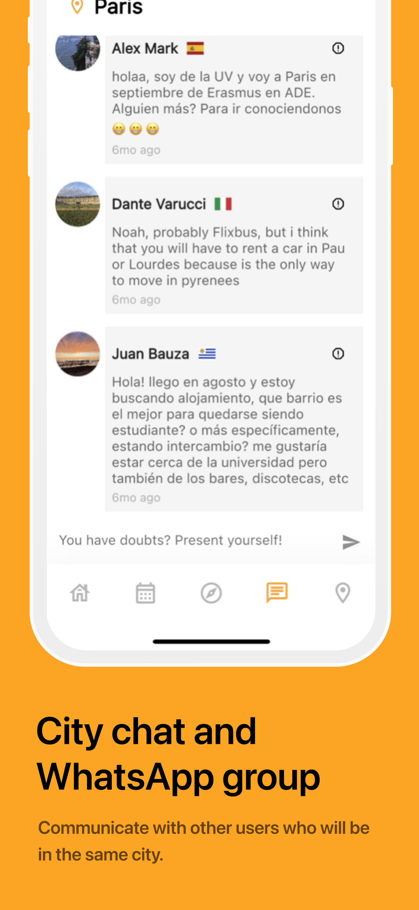

# Erasmusing

Erasmusing is a mobile application designed to cater to the needs of international students. It provides a platform for students to share their experiences, discover local events, and connect with peers during their study abroad journeys.

## Technologies Used

Erasmusing is built using the following technologies:

- **Flutter:** Flutter is Google's UI toolkit for building natively compiled applications for mobile, web, and desktop from a single codebase. Erasmusing leverages Flutter to deliver a smooth and consistent user experience across different platforms.

- **Firebase:** Firebase is a comprehensive app development platform provided by Google. Erasmusing utilizes Firebase for its backend services, including authentication, real-time database, and cloud storage. This allows for seamless user authentication and efficient data management.

## Availability

Erasmusing is publicly available on both the App Store and Google Play Store, enabling students from around the world to easily access and benefit from its features.

- [App Store](https://apps.apple.com/es/app/erasmusing/id1660829461)
- [Google Play Store](https://play.google.com/store/apps/details?id=com.erasmusing_code.erasmusing&hl=es_AR&pli=1)

## Features

- **Review Sharing:** Users can share their experiences and insights about various aspects of their study abroad journey, such as accommodation, restaurants, and attractions.

- **Event Discovery:** Erasmusing provides a platform for local student associations to showcase their events and activities, allowing users to explore and participate in community events.

- **Photo Feed:** Users can upload and view photos to capture and share memorable moments from their experiences abroad.

- **City-Wide Forum:** The app includes a city-wide forum where users can engage in discussions, ask questions, and seek advice from fellow students.

## Getting Started

To get started with Erasmusing, simply download the app from the App Store or Google Play Store and create an account. Once logged in, users can start exploring, sharing, and connecting with other students in their destination city.

## Contributing

Contributions to Erasmusing are welcome! If you have any ideas for new features, improvements, or bug fixes, feel free to open an issue on GitHub.

